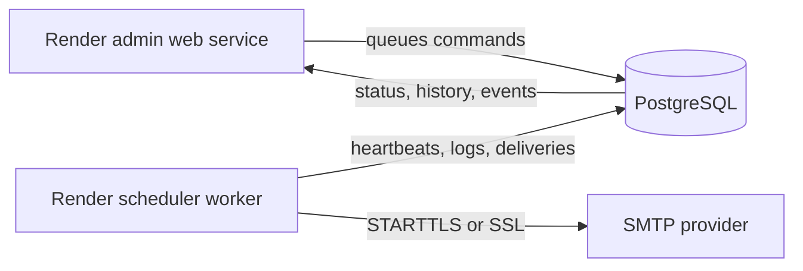

# Python Email Scheduler

A production-oriented worker that sends one daily report with an attachment.
It supports multiple To/CC recipients, safe SMTP authentication, delivery
retries, timezone-aware scheduling, rotating logs, graceful shutdown, and a
machine-readable health heartbeat.

The included MailOps admin dashboard adds authenticated remote controls,
module health, delivery history, a command audit trail, and searchable/exportable
application logs.



## Quick start

Python 3.10 or newer is required.

```powershell
python -m pip install -r requirements.txt

$env:EMAIL_HOST_USER = "sender@gmail.com"
$env:EMAIL_HOST_PASSWORD = "new-app-password"
$env:EMAIL_TO = "recipient@example.com"
$env:EMAIL_CC = "manager@example.com,team@example.com"
$env:REPORT_ATTACHMENT = "Reports/jay.pdf"
$env:REPORT_TIME = "08:30"
$env:REPORT_TIMEZONE = "Africa/Nairobi"

python daily_email_report.py --check-config
python daily_email_report.py --dry-run
python daily_email_report.py --check-smtp
python daily_email_report.py --send-now
python daily_email_report.py
```

The first four commands validate configuration, build the message without
sending, authenticate without sending, and perform a real one-time delivery.
The final command starts the persistent daily worker.

## Configuration

Use [`.env.example`](.env.example) as a reference. This application deliberately
does not load `.env` files; production secrets should come from the service,
container, or cloud environment.

### Email and SMTP

| Variable | Required | Default | Description |
| --- | --- | --- | --- |
| `EMAIL_HOST_USER` | Yes | - | SMTP login username |
| `EMAIL_HOST_PASSWORD` | Yes | - | SMTP/app password |
| `EMAIL_TO` | Yes | - | Comma-separated recipients |
| `EMAIL_CC` | No | Empty | Comma-separated CC recipients |
| `EMAIL_FROM` | No | SMTP username | Single From address |
| `EMAIL_HOST` | No | `smtp.gmail.com` | SMTP server |
| `EMAIL_SECURITY` | No | `starttls` | `starttls`, `ssl`, or `none` |
| `EMAIL_PORT` | No | `587`/`465` | SMTP port based on security mode |
| `EMAIL_TIMEOUT` | No | `30` | Connection timeout in seconds |
| `EMAIL_RETRIES` | No | `2` | Retries after transient SMTP errors |
| `EMAIL_RETRY_BASE_SECONDS` | No | `2` | Exponential retry base |
| `EMAIL_MAX_ATTACHMENT_MB` | No | `18` | Attachment limit safe for Gmail encoding overhead |

`EMAIL_USE_TLS=true/false` remains supported for compatibility when
`EMAIL_SECURITY` is not set. Do not use `EMAIL_SECURITY=none` across an
untrusted network.

### Report and schedule

| Variable | Default | Description |
| --- | --- | --- |
| `REPORT_ATTACHMENT` | `Reports/jay.pdf` | Attachment path, relative to this project |
| `REPORT_TIME` | `23:10` | Daily time in 24-hour `HH:MM` format |
| `REPORT_TIMEZONE` | `local` | IANA timezone such as `Africa/Nairobi` |
| `EMAIL_SUBJECT` | Daily report subject | Message subject |
| `EMAIL_BODY` | Built-in body | Plain-text message body |

The worker uses a fresh copy of the attachment at send time. It writes
`Auto-Submitted`, `Date`, and `Message-ID` headers to reduce reply loops and
make deliveries traceable.

### Operations

| Variable | Default | Description |
| --- | --- | --- |
| `EMAIL_LOG_FILE` | `email_scheduler.log` | Rotating log path; `-` disables file logs |
| `EMAIL_LOG_LEVEL` | `INFO` | Python log level |
| `EMAIL_LOG_MAX_MB` | `5` | Size of each rotating log file |
| `EMAIL_LOG_BACKUP_COUNT` | `3` | Retained log files |
| `EMAIL_LOG_CONSOLE` | `true` | Also emit logs to stdout |
| `EMAIL_STATUS_FILE` | `email_scheduler_status.json` | Atomic heartbeat file |
| `SCHEDULER_HEARTBEAT_SECONDS` | `60` | Heartbeat update interval |
| `SCHEDULER_POLL_SECONDS` | `30` | Maximum shutdown/schedule polling interval |
| `EMAIL_HEALTH_MAX_AGE_SECONDS` | `300` | Maximum healthy heartbeat age |
| `DATABASE_URL` / `MONITOR_DATABASE_URL` | Local SQLite | Shared monitoring database |
| `MONITORING_REQUIRED` | `false` | Stop startup if monitoring is unavailable |

Inspect or probe the running worker:

```powershell
python daily_email_report.py --status
python daily_email_report.py --healthcheck
```

The health check exits `0` only while the scheduler state is `running`,
`sending`, or intentionally `paused` and the heartbeat is fresh. SIGINT and SIGTERM stop the worker
gracefully and change its status to `stopped`.

## Admin dashboard

Run the dashboard locally with SQLite after setting the worker variables above:

```powershell
$env:MONITORING_ENABLED = "true"
$env:MONITOR_DATABASE_URL = "sqlite:///scheduler_monitor.db"
$env:ADMIN_USERNAME = "admin"
$env:ADMIN_PASSWORD = "use-a-long-random-password"
$env:ADMIN_SECRET_KEY = "use-an-independent-32-byte-random-secret"

# Terminal 1
python daily_email_report.py

# Terminal 2
python admin_dashboard.py
```

Open `http://localhost:8000`. The dashboard provides:

- live worker, database, scheduler, SMTP, attachment, and command-queue health;
- scheduler state, next run, heartbeat, last success, and last error;
- real-time delivery totals and complete delivery history;
- searchable, filterable application and audit logs with streaming CSV export;
- a complete command ledger showing requester, result, and completion time;
- audited actions for **send now**, **dry run**, **check SMTP**, **check
  configuration**, **pause**, and **resume**.

Actions are written to the shared database and executed by the worker. The web
service never receives or handles the SMTP password. Login sessions expire
after eight hours and use secure cookies on Render, CSRF protection, security
headers, constant-time credential checks, and login rate limiting.

## Production deployment

### Render Blueprint

[](https://render.com/deploy?repo=https://github.com/DataGeek404/Python-Email-Scheduler)

[`render.yaml`](render.yaml) creates three connected resources:

1. `email-scheduler-admin` — the authenticated web dashboard;
2. `email-scheduler-worker` — exactly one background scheduler;
3. `email-scheduler-db` — shared PostgreSQL monitoring and command storage.

To deploy:

1. Push this repository to GitHub.
2. In Render, choose **New → Blueprint** and connect the repository.
3. Render reads `render.yaml`. Enter every prompted secret:
   `ADMIN_PASSWORD`, `EMAIL_HOST_USER`, `EMAIL_HOST_PASSWORD`, `EMAIL_FROM`,
   `EMAIL_TO`, and optional `EMAIL_CC`.
4. Apply the Blueprint and wait for the database, admin web service, and worker
   to become live.
5. Open the admin service URL and sign in as `admin` with `ADMIN_PASSWORD`.
6. From the dashboard, run **Check configuration**, **Check SMTP**, **Build dry
   run**, then **Send report now** in that order.

The Blueprint uses paid production-sized plans (`starter` services and a
`basic-256mb` database). You may change plans in `render.yaml`, but Render does
not normally provide a free background-worker tier. Keep the worker scaled to
exactly one instance to prevent duplicate daily emails.

Render stdout logs remain available in the Render console. Application,
delivery, command, and authentication events are also stored in PostgreSQL and
visible from the dashboard.

### Docker

```bash
docker build -t email-scheduler .
docker run -d --name email-scheduler --restart unless-stopped \
  --env-file .env email-scheduler
```

The container runs as a non-root user, logs to stdout, and includes a Docker
health check. Keep exactly **one worker replica** running; multiple replicas
would each send the daily email.

### Heroku

The `Procfile` validates configuration during the release phase and starts the
scheduler as a worker. Set all required Config Vars, deploy, then ensure one
worker is enabled:

```bash
heroku ps:scale worker=1 -a your-app-name
```

The GitHub workflow tests Python 3.10, 3.12, and 3.13 before deployment. To
enable its optional Heroku deployment, configure the repository variable
`HEROKU_APP_NAME` and production environment secret `HEROKU_API_KEY`.

## Verification

No test connects to a real SMTP server:

```powershell
python -m unittest discover -s tests -v
python -m py_compile daily_email_report.py monitoring.py admin_dashboard.py
```

## Security note

The original repository contained a Gmail app password in source control.
Revoke that credential even though it is no longer present in current code;
Git history may still contain it. Never commit `.env` or provider credentials.
